#GitEye Guide
Please ensure that you have downloaded and installed [GitEye](http://www.collab.net/giteyeapp) and that you have a [GitHub](http://www.github.com) account before continuing.

##Setting-up GitEye
You will need to configure a couple of settings when you first launch GitEye, you should only need to do this once as it stores the settings for you.

This is how the application should look when you first launch it:

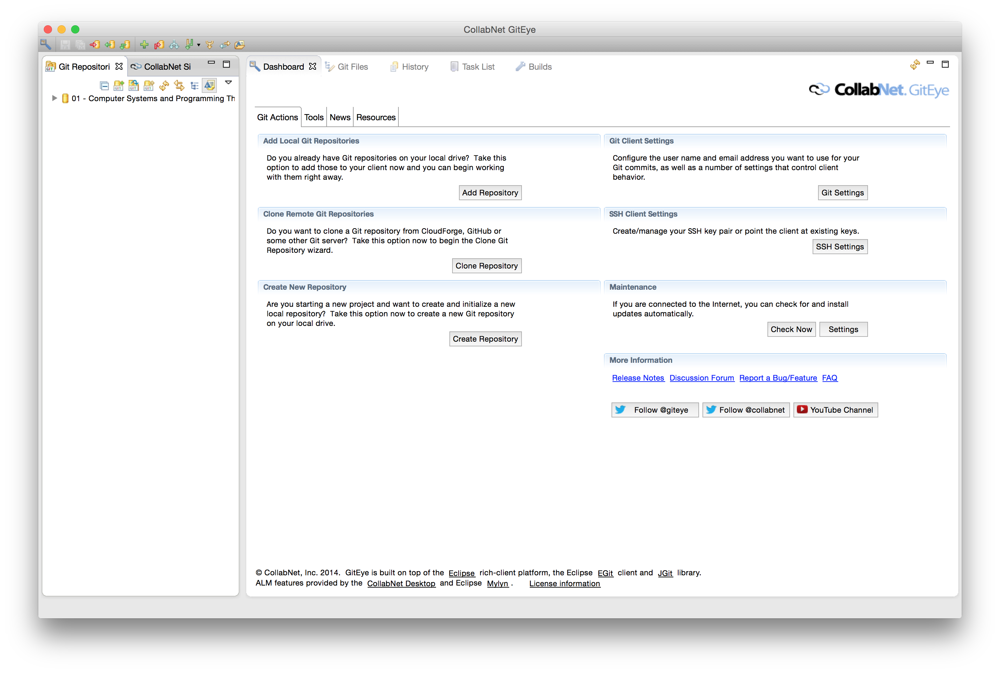

1. Click on the button labelled **Git Settings** (highlighted above)
2. In the **Preferences** pane that appears select:
    - **Team -> Git -> Configuration**

    This should result in the following being displayed:

    

3. Click on the **Add Entry...** button to add your name and email address:

    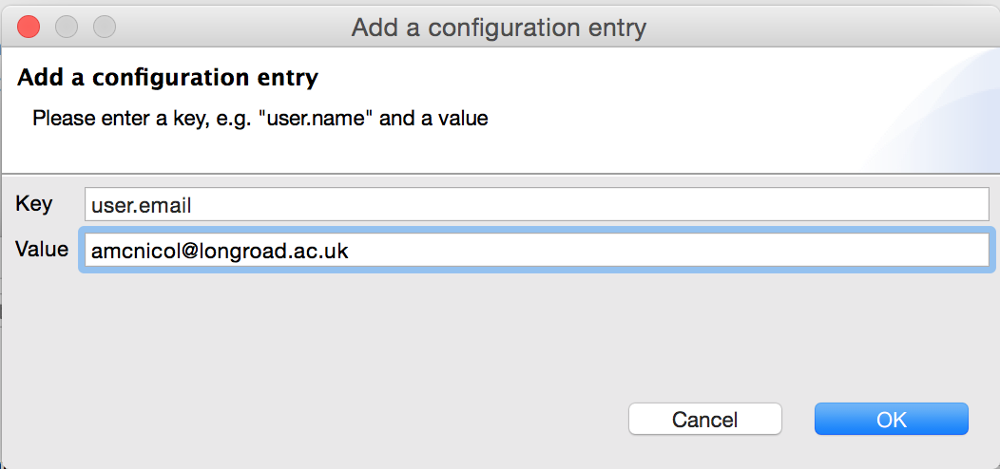

    Notice that to enter your e-mail address the key must be **user.email** and not just email. This is likewise true of your name i.e. **user.name**.

4. Once you have added both your name and e-mail address click **Apply** and then **OK** to dismiss the preferences pane.

You have now configured the basic settings of GitEye.

##Creating a New Repository/Project
To create a new project for your files you should start on **GitHUb** as it will simplify the process of ensuring that your files remain in sync.

1. Go to [GitHub](http://www.github.com) and sign in with your account details. You should be then presented with a page similar to the one below:

    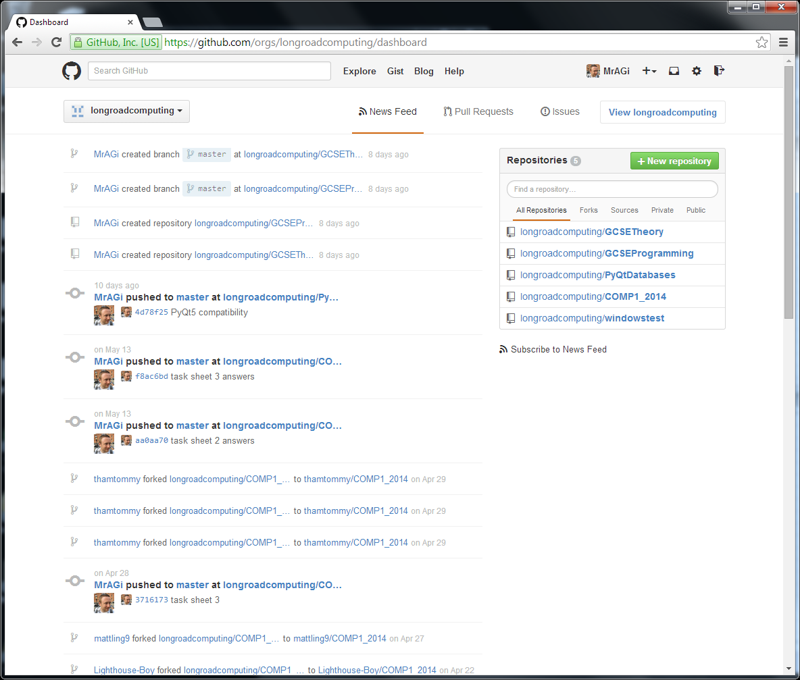

2. Select the **Add (+)** button at the top right of the page and **Create a New repository**.

    

3. Enter the details for the repository (making sure to tick the box for the **READ ME** file) and then click on the green **Create Repository** button:

    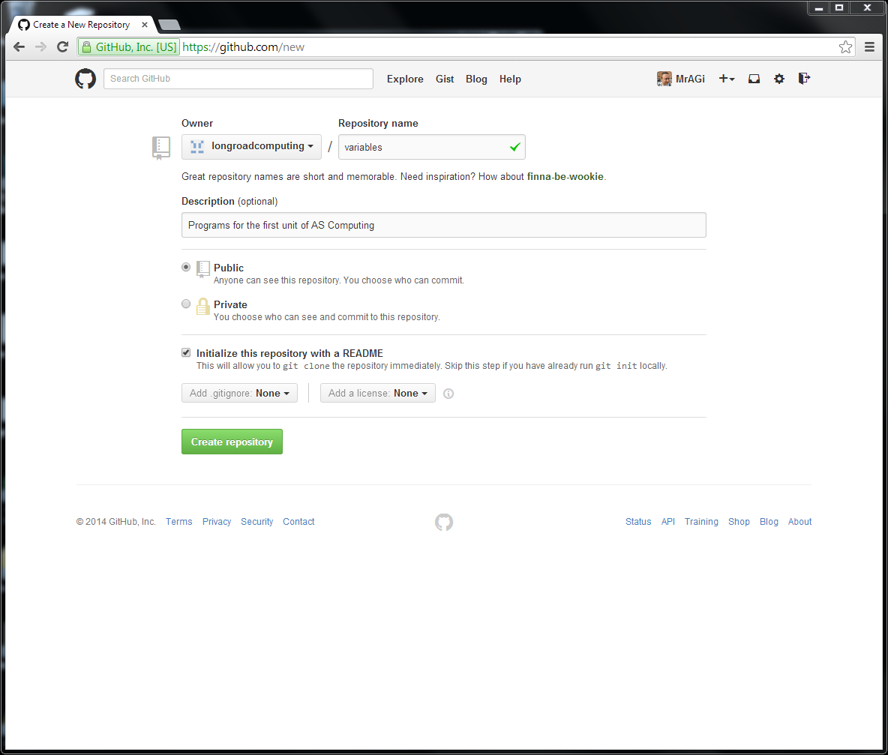

4. This will create your repository and eventually you will end up at the project page:

    

##Cloning the New Repository/Project to GitEye
Having created the new repository on GitHub you can now **clone** this to GitEye to start working locally on your machine.

Once you have cloned the project once you should not need to perform this step again.

1. In the main GitEye interface click on the **Clone Repository** button:

    

2. This will bring up the wizard. Select **Clone URI** and click **Next**:

    

3. Switch back to your **GitHub** project page and click on the button on the right to **clone URL**:

    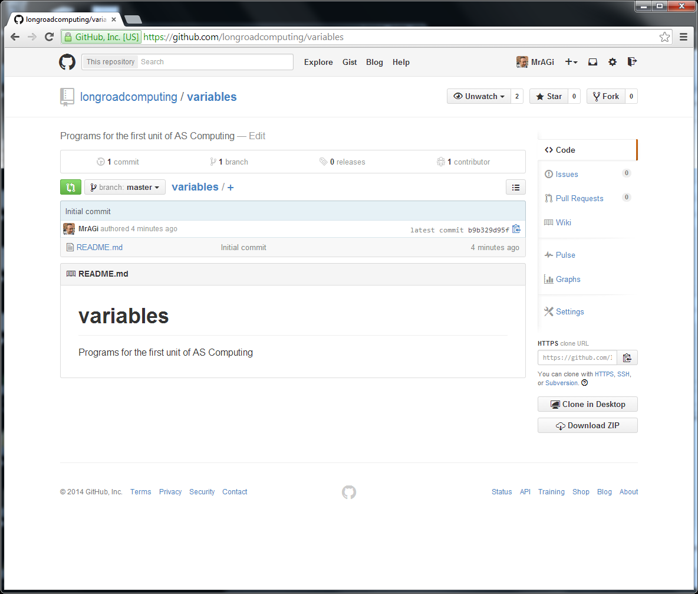

4. Paste the copied URL into the **URI** box on the wizard and then fill in your **GitHub username and password** and then click **Next**:

    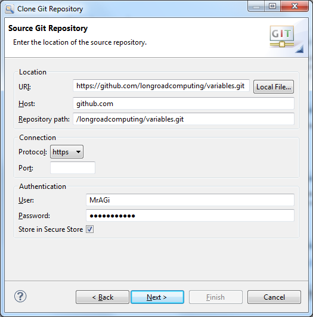

5. GitEye should automatically pick up the **master** branch of your repository and then should just click **Next**:

    

6. Configure where you want to store the repository on your local computer. A good idea is to have a **git** directory on your **U:\\** drive and store all of your repositories there:

    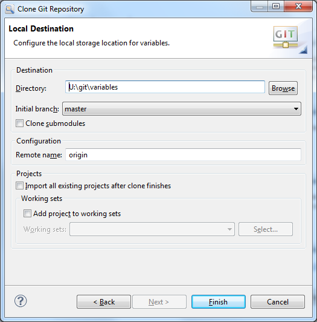

7. Your repository should now be available on the left of the main GitEye interface:

    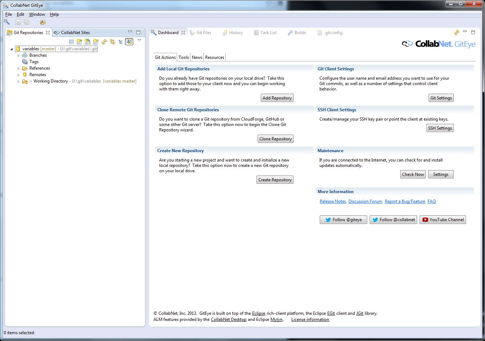

##Adding Files to an Existing Repository
Once you have cloned the repository you can begin to add files to it locally and have the changes synced to the GitHub website.

1. Create a new file in IDLE:

    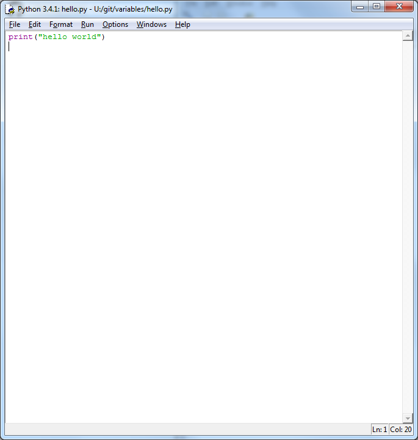

2. Save this file into the **correct** directory for the repository you have just cloned. In this case **U:\git\variables\\**:

    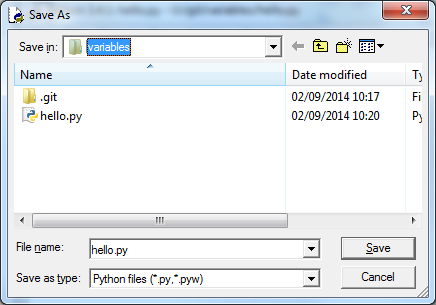

3. Switch back to GitEye, making sure that the **correct project** is highlighted on the left, select the **Git Files** tab of the interface:

    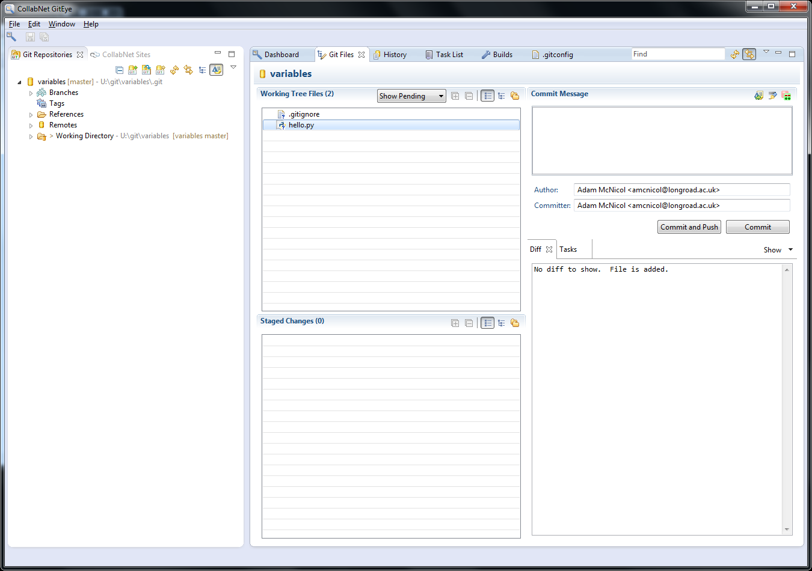

4. You should see any files that are new or have been edited recently in the **pending** panel. If they are not there click on the **refresh** button at the top right of the application.

5. Drag the files you wish to commit from the pending panel to the **Staged Changes** panel. Then enter your commit message in the relevant space. Make sure that the Author and Committer are correct.

    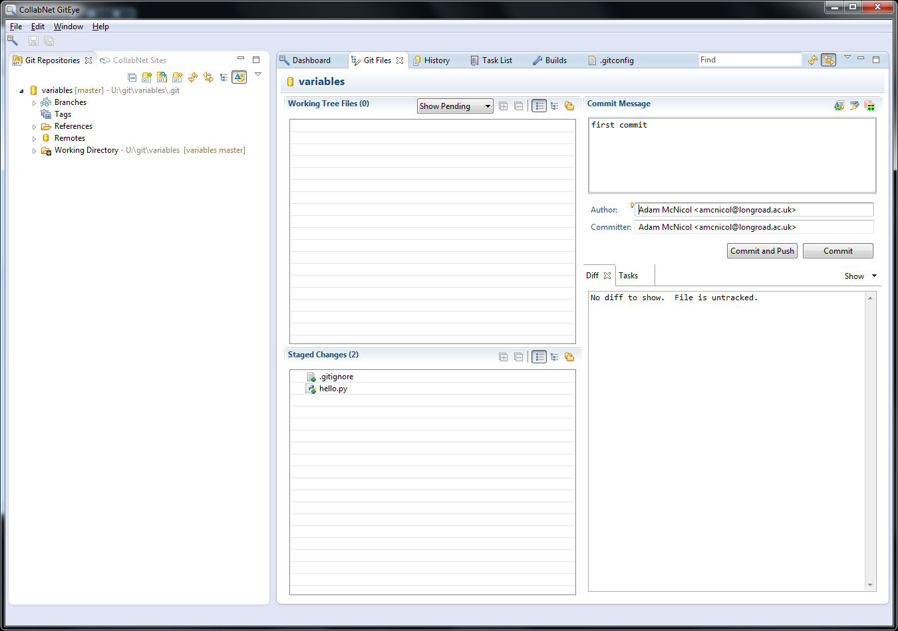

6. Finally, click the **Commit and Push** button. This will automatically send your changes to the GitHub website.

##Checking Recent Commits
To begin with you may want to check to make sure that the commit has successfully synced to the GitHub website.

1. Visit the repository page on the GitHub site:

    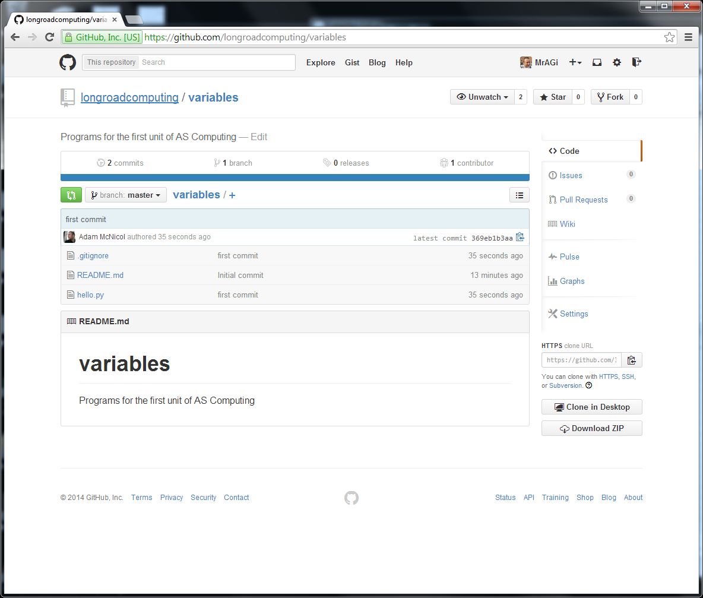

2. Select the **commits** link that is towards the top of the page. Depending on how many commits you have made this will be different. In the example above it says **2 commits**.

3. This will take you to the commit page. Here you can check that the most recent **commit message** matches the one your entered in GitEye for the last commit:

    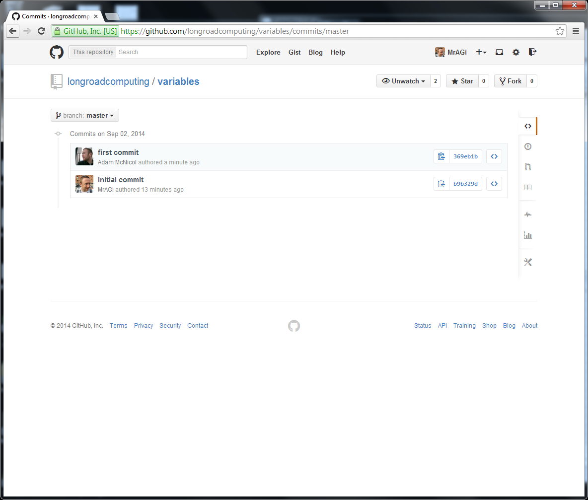

4. If the messages matches then everything went according to plan. If not then check back through and make sure you have not missed a step out!
